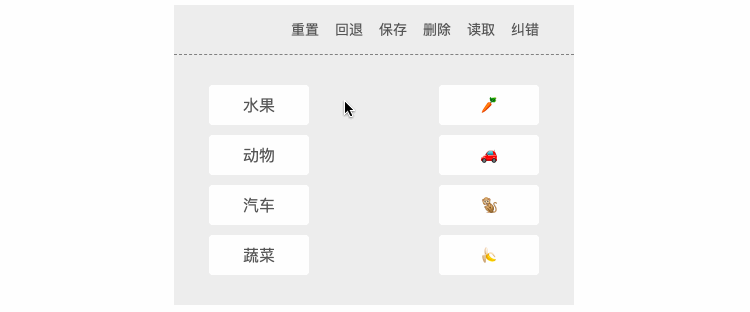
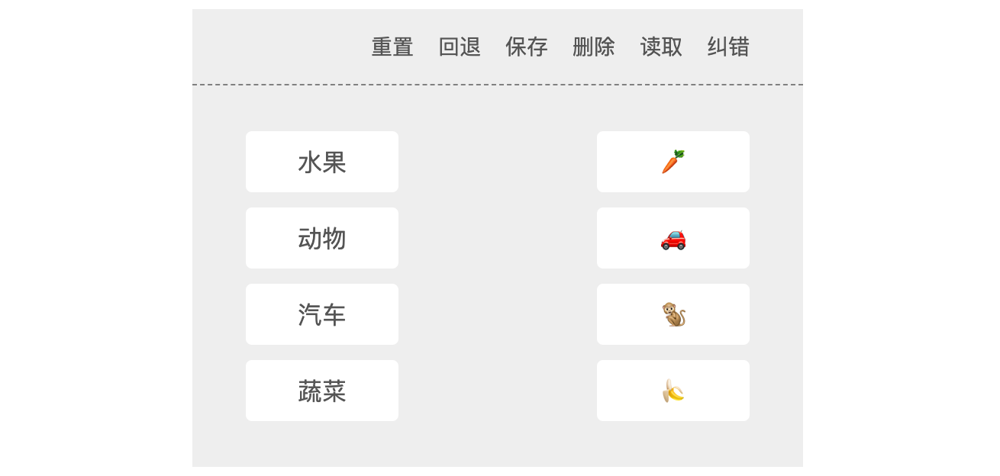

# 概述

最近在做一个考试系统，其中有一个题型是 **连线题**，当时在网上查阅了大量的资料，没找到自己想要的效果，于是决定自己实现。

效果如下：



本示例主要使用原生js + canvas 实现，为了各位看官能够理解实现，代码中有大量的注释，并且没有过度封装和抽离。后续会基于此将其封装成一个类，并且实现在React和Vue中的应用。

# 需求

1. 左右布局，支持 **1对1双向连线**（即从左侧连到右侧，从右侧连到左侧）。
2. 支持【重置画板】【回退/撤销】【保存连线记录】【删除连线记录】【读取连线记录】【纠错】功能

# 实现

在开始实现之前，首先我们需要确定一下相关的数据结构：

1. 连线答案结构

   ```js
   [[L1, R1], [L2, R2], [L3, R3], ...]
   ```

   这个结构将作为连线题的 **答案** 发送至后端，查看试卷时，后端也会返回这个结构用于回显以及批阅时纠错。

2. 连线记录结构

   ```js
   [
     { anwser: [L1, R1], point: { x1, y1, x2, y2 } },
     { anwser: [L1, R1], point: { x1, y1, x2, y2 } },
     ...
   ];
   ```

   - `anwser`：存储每一条连线中，左侧元素的id（数组的第1个元素）和右侧元素的id（数组的第2个元素）
   - `point`：连线元素锚点（*顺序无所谓，只要有两个点确保能连成一条线即可*）

3. 纠错结构

   ```js
   [
     { isOk, point: { x1, y1, x2, y2 } },
     { isOk, point: { x1, y1, x2, y2 } },
     ...
   ];
   ```

   - `isOk`：布尔值，标识当前连线是否正确，用于在绘制线条时赋予不同的颜色标注，比如 ❎用红色，✅用蓝色。
   - `point`：连线元素锚点（*顺序无所谓，只要有两个点确保能连成一条线即可*）

> 提示：实现章节中，我将根据我的实现思路，按顺序编辑，所以你只需要从上往下阅读文章并敲代码实践即可，文章的最后，我会贴上脚本部分的完整代码。

## 布局 & 样式



两列布局，基于 flex 实现，画板用了两个 `canvas` 标签，一个用于实际连线，因为在连接的过程中，有可能会取消，此时会调用 crearRect 清除画板，为了避免将之前的记录一起给清楚了，所以需要另一个画板用于回显，主要展示已经连接好的路径。

**`index.html`**

```html
<div class="container">
  <!-- 工具栏 -->
  <div class="tools">
    <div class="button reset">重置</div>
    <div class="button back">回退</div>
    <div class="button save">保存</div>
    <div class="button delete">删除</div>
    <div class="button read">读取</div>
    <div class="button check">纠错</div>
  </div>
  <div class="content">
    <!-- 左侧 -->
    <div class="list left">
      <div class="item" id="L1" data-ownership="L">水果</div>
      <div class="item" id="L2" data-ownership="L">动物</div>
      <div class="item" id="L3" data-ownership="L">汽车</div>
      <div class="item" id="L4" data-ownership="L">蔬菜</div>
    </div>
    <!-- 右侧 -->
    <div class="list right">
      <div class="item" id="R1" data-ownership="R">🥕</div>
      <div class="item" id="R2" data-ownership="R">🚗</div>
      <div class="item" id="R3" data-ownership="R">🐒</div>
      <div class="item" id="R4" data-ownership="R">🍌</div>
    </div>
    <!-- 实际连线标签 -->
    <canvas id="canvas" width="400" height="250">您的浏览器不支持Canvas，请下载最新版本</canvas>
    <!-- 模拟连线标签 -->
    <canvas id="backCanvas" width="400" height="250">您的浏览器不支持Canvas，请下载最新版本</canvas>
  </div>
</div>
```

> 提示：在布局标签时，`data-id` 标识数据，`data-ownership` 标识元素所在的区间，`L` 表示左侧，`R` 表示右侧。

**`./css/index.css`**

```css
.container {
  width: 400px;
  margin: 100px auto;
}

.tools {
  height: 50px;
  display: flex;
  justify-content: flex-end;
  align-items: center;
  background-color: #EEE;
  box-sizing: border-box;
  padding: 0 35px;
  border-bottom: 1px dashed #808080;
  font-size: 14px;
  color: #555;
  cursor: pointer;
}

.tools .button:not(:first-child) {
  margin-left: 16px;
}

.tools .button:hover {
  color: #1E90FF;
}

.content {
  width: 400px;
  height: 250px;
  background: #EEE;
  box-sizing: border-box;
  padding: 0 35px;
  display: flex;
  justify-content: space-between;
  align-items: center;
  position: relative;
}

.list:last-child {
  font-size: 26px;
}

.item {
  width: 100px;
  height: 40px;
  background-color: #fff;
  display: flex;
  justify-content: center;
  align-items: center;
  border-radius: 4px;
  cursor: pointer;
  user-select: none;
  color: #555;
  position: relative;
  z-index: 1;
}

.item:not(:last-child) {
  margin-bottom: 10px;
}

.item.active {
  background: #6495ED;
  color: #FFF;
}

#canvas,
#backCanvas {
  width: 100%;
  height: 100%;
  position: absolute;
  top: 0;
  left: 0;
}
```

## 获取Canvas & 配置画笔

```js
// 第1步：获取Canvas & 配置画笔
const canvas = document.getElementById("canvas");
const backCanvas = document.getElementById("backCanvas");
canvas.width = backCanvas.width = 400;
canvas.height = backCanvas.height = 250;

/** @type {CanvasRenderingContext2D} */
const ctx = canvas.getContext("2d");
const backCtx = backCanvas.getContext("2d");

ctx.strokeStyle = backCtx.strokeStyle = 'blue';
ctx.lineWidth = backCtx.lineWidth = 2;
```

## 获取必要元素，挂载数据

```js
// 第2步：获取列表元素，挂载后续操作所需的数据
const listItems = document.querySelectorAll('.list .item');
// 记录canvas距离屏幕左上角的位置，用于计算移动时鼠标在画布中的位置
let canvasTop = 0;
let canvasLeft = 0;
calcRect();
// 缩放窗口时，实时更新数据
window.onresize = calcRect;
function calcRect() {
  // TODO: 节流优化
  // 更新canvas距离屏幕左上角的位置
  const rect = canvas.getBoundingClientRect()
  canvasTop = rect.top;
  canvasLeft = rect.left;

  // 记录节点信息
  listItems.forEach(item => {
    // 获取元素在屏幕上的信息
    const { left, top, width, height } = item.getBoundingClientRect();
    // 获取元素归属：左侧还是右侧·用于计算元素锚点坐标
    const ownership = item.dataset.ownership;
    // 记录元素锚点坐标
    const anchorX = ownership === 'L' ? item.offsetLeft + width : item.offsetLeft;
    const anchorY = item.offsetTop + height / 2;
    item.dataset.anchorX = anchorX;
    item.dataset.anchorY = anchorY;

    // 标识当前元素是否连线
    item.dataset.checked = '0';

    // 绘制锚点，查看锚点位置是否准确（临时代码）
    // ctx.beginPath();
    // ctx.arc(anchorX, anchorY, 4, 0, Math.PI * 2);
    // ctx.stroke();
    // ctx.closePath();
  });
}
```

## 绑定事件

```js
// 第3步：绑定事件
listItems.forEach((item) => (item.onmousedown = onMousedown));
document.onmousemove = onMousemove;
document.onmouseup = onMouseup;
```

## 连线相关（核心逻辑）


分析：

1. 当鼠标按在（mousedown）某个元素上时，该元素将作为 **开始元素**（不管左侧还是右侧）
2. 在鼠标按下移动的过程中，需实时基于canvas显示路径（直线，将开始元素的锚点作为开始点，将鼠标移动的实时位置作为结束点）
3. 当鼠标经过（mousemove） **目标元素**（如果起始元素在左侧，那目标元素一定是在右侧，反之亦然） 时，如果 **目标元素** 未被选中，则标识开始元素和目标元素的连线状态。
4. 当鼠标抬起（mouseup）时：
   - 未命中任何目标元素，删除路径，并恢复开始元素的状态
   - 命中目标元素，判断目标元素是否已连线
     - 已连线：删除路径，并恢复开始元素的状态
     - 未连线：更新路径，直接将开始元素和目标元素的锚点连接在一起，并且高亮起始元素和目标元素，标识已选中。
5. 如果开始元素已连线，可以修改连线，将其连接到未连线的目标元素上，同时将之前匹配的目标元素恢复初始状态。
6. 具体的逻辑在代码中有体现...

代码：

```js
// 第4步：连线相关（核心逻辑）
let trigger = false; // 标识是否触发连线
let startPoint = { x: 0, y: 0 }; // 记录每一次连线开始点
let endPoint = { x: 0, y: 0 }; // 记录每一次连线结束点
let startElement = null; // 记录每一次连线开始元素
let endElement = null; // 记录每一次连线结束元素
let backLines = []; // 记录已经连接好的线·数据结构 → { anwser: [左侧元素ID, 右侧元素ID], point: {x1, y1, x2, y2}}[]
let pair = 0; // 记录连线次数

function onMousedown(event) {
  // 高亮显示按下的元素
  if (!this.classList.contains('active')) {
    this.classList.add('active');
  }
  // 记录每一次连线的开始元素
  startElement = this;

  // 更新每一次连线开始点信息
  startPoint.x = +this.dataset.anchorX;
  startPoint.y = +this.dataset.anchorY;

  // 标识触发连线，用于在mousemove中判断是否需要处理后续的逻辑
  trigger = true;
  // 阻止时间冒泡/默认行为
  event.stopPropagation();
  event.preventDefault();
}


function onMousemove(event) {
  if (trigger) {
    /****************
     * 处理连线
     ****************/
    // 获取鼠标在屏幕上的位置
    const { clientX, clientY } = event;
    // 计算鼠标在画板中的位置
    const endPoint = {
      x: clientX - canvasLeft,
      y: clientY - canvasTop
    }
    // 连线：实际画板
    ctx.clearRect(0, 0, canvas.width, canvas.height);
    ctx.beginPath();
    ctx.moveTo(startPoint.x, startPoint.y);
    ctx.lineTo(endPoint.x, endPoint.y);
    ctx.closePath();
    ctx.stroke();

    /****************
     * 处理后续逻辑
     ****************/

    // 获取鼠标经过的元素
    const overElement = document.elementFromPoint(clientX, clientY);
    // 获取开始元素归属：左侧还是右侧
    const ownership = startElement.dataset.ownership;
    // 如果鼠标经过的元素等于目标元素，不作任何处理
    if (overElement === endElement) return;
    // 判断是否命中目标元素，条件如下（同时满足）
    // ① 鼠标经过的元素必须包含类名 item
    // ② 鼠标经过的元素和开始元素不在同一侧
    // ③ 鼠标经过的元素未被连线
    const condition1 = overElement.classList.contains('item');
    const condition2 = overElement.dataset.ownership !== ownership;
    const condition3 = overElement.dataset.checked !== '1';
    if (condition1 && condition2 && condition3) {
      // 记录目标元素
      endElement = overElement;
      // 更新目标元素状态（高亮显示）
      endElement.classList.add('active');
      // 将开始元素和目标元素表示为已连线
      endElement.dataset.checked = '1';
      startElement.dataset.checked = '1';
    }
    // 如果没有命中目标元素，但是目标元素又存在，则移除相关状态
    else if (endElement) {
      endElement.classList.remove('active');
      endElement.dataset.checked = startElement.dataset.checked = '0';
      endElement = null;
    }
  }
  // 阻止时间冒泡/默认行为
  event.stopPropagation();
  event.preventDefault();
}

function onMouseup() {
  // 如果开始元素存在且未被连线，则恢复开始元素的状态
  if (startElement && startElement.dataset.checked !== '1') {
    startElement.classList.remove('active');
  }
  // 完成连线：开始元素和目标元素同时存在，并且被标识选中
  if (
    startElement && endElement && 
    startElement.dataset.checked === '1' && endElement.dataset.checked === '1'
  ) {
    // 获取连线始末坐标点
    const { anchorX: x1, anchorY: y1 } = startElement.dataset;
    const { anchorX: x2, anchorY: y2 } = endElement.dataset;
    // 获取开始元素归属：左侧还是右侧
    const ownership = startElement.dataset.ownership;
    // 获取开始元素的id
    const startId = startElement.id;
    // 判断开始元素是否已经完成连线·遍历backLines，判断存储答案的集合中是否包含开始元素的id，存在则更新index
    let index = -1;
    for (let i = 0; i < backLines.length; i++) {
      const item = backLines[i];
      if (item.anwser.includes(startId)) {
        index = i;
        break;
      }
    }
    // 如果元素已经完成连线，则需将连线的目标元素恢复成未连线状态，具体步骤
    // ① 获取目标元素的ID
    // ② 根据ID获取目标元素
    // ③ 恢复目标元素的状态（标识+高亮状态）
    // ④ 将对应的数据从记录中移出（因为后面会重新插入数据）
    if (index !== -1) {
      const tarElementId = backLines[index].anwser[ownership === 'L' ? 1 : 0];
      const tarElement = document.getElementById(tarElementId);
      tarElement.dataset.checked = '0';
      tarElement.classList.remove('active');
      backLines.splice(index, 1);
    }

    // 组装数据，存入记录
    backLines.push({
      anwser: ownership === 'L' ? [startElement.id, endElement.id] : [endElement.id, startElement.id],
      point: { x1, y1, x2, y2 }
    });
    // 绘制连线结果
    drawLines();
  }

  // 恢复元素状态
  trigger = false;
  startElement = null;
  endElement = null;
  // 清空实际连线画布
  ctx.clearRect(0, 0, canvas.width, canvas.height);
}
// -- 模拟连线
function drawLines() {
  backCtx.clearRect(0, 0, backCanvas.width, backCanvas.height);
  backLines.map(({ point: { x1, x2, y1, y2 } }) => {
    backCtx.beginPath();
    backCtx.moveTo(x1, y1);
    backCtx.lineTo(x2, y2);
    backCtx.closePath();
    backCtx.stroke();
  });
}
```

## 重置画板

思路：

① 清空模拟连线画布

② 恢复元素初始状态

③ 置空连线记录

```js
// 第5步：重置
const btnReset = document.querySelector('.reset');
btnReset.onclick = function () {
  backCtx.clearRect(0, 0, backCanvas.width, backCanvas.height);
  listItems.forEach(item => {
    item.classList.remove('active');
    item.dataset.checked = '0';
  });
  backLines = [];
}
```

## 回退/撤销

思路：

① 将最后一次连线的数据从连线记录中移除

② 获取连线元素并恢复其初始状态

③ 重新绘制模拟连线

```js
// 第6步：回退
const btnBack = document.querySelector('.back');
btnBack.onclick = function () {
  const { anwser: [startId, endId] } = backLines.pop();
  const startElement = document.getElementById(startId);
  const endElement = document.getElementById(endId);
  startElement.dataset.checked = endElement.dataset.checked = '0';
  startElement.classList.remove('active');
  endElement.classList.remove('active');
  drawLines();
}
```

## 保存连线记录

思路：

① 从连线记录中组装答案结构列表：`[[id1, id2], [id3, id4]...]`

② 将答案存储至本地

```js
// 第7步：保存答案
const getAnwsers = () => {
  const anwsers = [];
  backLines.forEach(({ anwser }) => anwsers.push([...anwser]));
  return anwsers;
}
const saveAnwsers = () => {
  const anwsers = getAnwsers();
  if (anwsers.length > 0) {
    localStorage.setItem('ANWSERS', JSON.stringify(anwsers));
    console.log('保存成功');
  } else {
    console.log('没有可保存的数据');
  }
}
const btnSave = document.querySelector('.save');
btnSave.onclick = saveAnwsers;
```

## 删除连线记录

```js
// 第8步：删除答案
const btnDelete = document.querySelector('.delete');
btnDelete.onclick = () => {
  localStorage.removeItem('ANWSERS');
  console.log('删除成功');
};
```

## 读取连线记录

思路：

① 从本地读取数据

② 判断数据是否存在，如果存在，则遍历数据做后续处理

③ 获取每一条线路的开始元素和目标元素

④ 更新开始元素和目标元素的状态：选中状态/高亮显示

⑤ 计算连线坐标

⑥ 拼装数据并绘制到模拟连线画板上

```js
// 第9步：读取(回显）答案

const showAnwsers = () => {
  const localAnwsers = localStorage.getItem('ANWSERS');
  if (localAnwsers) {
    const anwsers = JSON.parse(localAnwsers);
    anwsers.forEach(([startId, endId]) => {
      // 获取开始元素和目标元素
      const startElement = document.getElementById(startId);
      const endElement = document.getElementById(endId);
      // 更新选中状态
      startElement.dataset.checked = endElement.dataset.checked = '1';
      // 高亮显示元素
      startElement.classList.add('active');
      endElement.classList.add('active');
      // 计算坐标
      const { anchorX: x1, anchorY: y1 } = startElement.dataset;
      const { anchorX: x2, anchorY: y2 } = endElement.dataset;
      // 拼装数据
      backLines.push({
        anwser: [startId, endId],
        point: { x1, y1, x2, y2 }
      });
      drawLines();
    });
  } else {
    console.log("没有可回显的数据")
  }
}
const btnShow = document.querySelector('.read');
btnShow.onclick = showAnwsers;
```

## 纠错

思路：

① 从本地读取数据

② 判断数据是否存在，如果存在，则遍历数据做后续处理

③ 获取每一条线路的开始元素和目标元素

④ 更新开始元素和目标元素的状态：选中状态/高亮显示

⑤ 计算连线坐标

⑥ 拼装数据并绘制到模拟连线画板上

```js
// 第10步：纠错
const standardAnwsers = [
  ['L1', 'R4'],
  ['L2', 'R3'],
  ['L3', 'R2'],
  ['L4', 'R1'],
];
const checkAnwsers = () => {
  const localAnwsers = localStorage.getItem('ANWSERS');
  if (localAnwsers) {
    const anwsers = JSON.parse(localAnwsers);
    const lines = [];
    anwsers.forEach(([startId, endId]) => {
      /****************
      * 找到用户连线的数据
      ****************/
      // 获取开始元素和目标元素
      const startElement = document.getElementById(startId);
      const endElement = document.getElementById(endId);
      // 更新选中状态
      startElement.dataset.checked = endElement.dataset.checked = '1';
      // 高亮显示元素
      startElement.classList.add('active');
      endElement.classList.add('active');
      // 计算坐标
      const { anchorX: x1, anchorY: y1 } = startElement.dataset;
      const { anchorX: x2, anchorY: y2 } = endElement.dataset;
      /****************
      * 处理纠错逻辑
      ****************/
      // 找到当前连线数据对应的标准答案
      const standardAnwser = standardAnwsers.find(item => item[0] === startId);
      // 拼装数据
      lines.push({
        point: { x1, y1, x2, y2 },
        isOk: endId === standardAnwser[1]
      });
    });
    // 绘制模拟连线画板
    backCtx.clearRect(0, 0, backCanvas.width, backCanvas.height);
    lines.forEach(({ isOk, point: { x1, y1, x2, y2 } }) => {
      backCtx.strokeStyle = isOk ? 'blue' : 'red';
      backCtx.beginPath();
      backCtx.moveTo(x1, y1);
      backCtx.lineTo(x2, y2);
      backCtx.stroke();
    });
    backCtx.strokeStyle = 'blue';
  } else {
    console.log("没有可纠错的数据")
  }
}
const btnCheck = document.querySelector('.check');
btnCheck.onclick = checkAnwsers;
```

可以看到，【纠错】部分的代码和【读取连线记录】的代码大部分都是相同的，区别就在于，【纠错】时需根据标准答案判断连线的记录是否正确，通过 `isOK` 标识，在绘制到模拟连线画板上时，会根据状态决定绘制的颜色，实际上，在应用中我们应该抽离一部分公共代码，但是为了大家能够看懂，这里我并没有这么做。

# 完整代码


